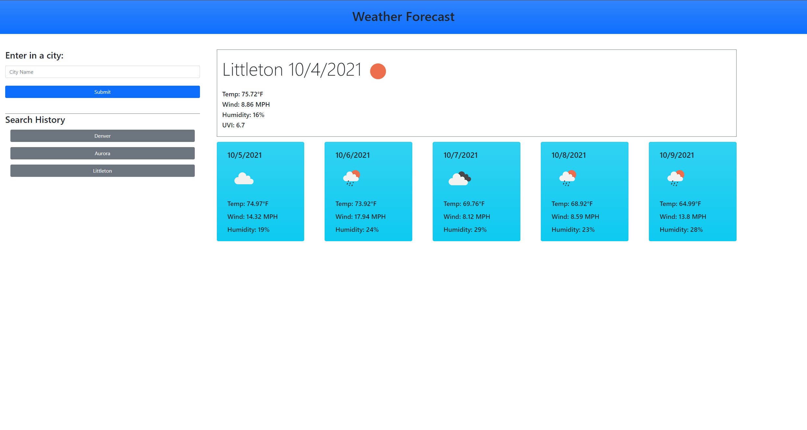

----------------
Title: Weather Dashboard
Description: Displays weather information about a searched city
Readme Author: Ryan Paragas
Created: 10/4/21
----------------

## Weather Dashboard
================

Live Website: [Live Website](https://paragasr.github.io/Weather-Dashboard/)

This website will return the current weather data as well as a 5 day weather forecast for the searched result. The search results will be saved as buttons that can be revisited by the user. The information displayed is the City name that was searched, the date, an icon of the weather status, temperature, wind speed, humidity, and only the current UV index. The UV index is color coded to represent whether it is favorable, moderate, or severe.

Website preview: 
